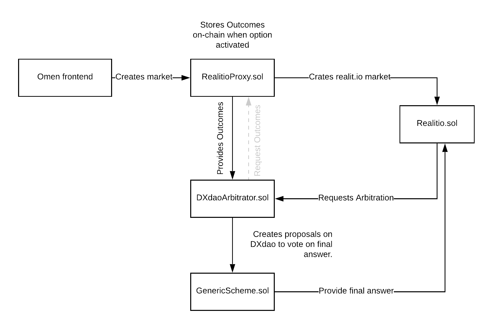

# DXdao Arbitrator #
A realit.io arbitrator contract to request and submit dispute resolutions to the dxDAO.

### Instructions
`yarn`
`yarn compile`
`yarn test`

### Linting and formatting
Uses solhint + prettier, with solhint-plugin-prettier to have them play nicely.

##### View linting results
`yarn solhint` 

##### Fix formatting
`yarn prettier:solidity` 